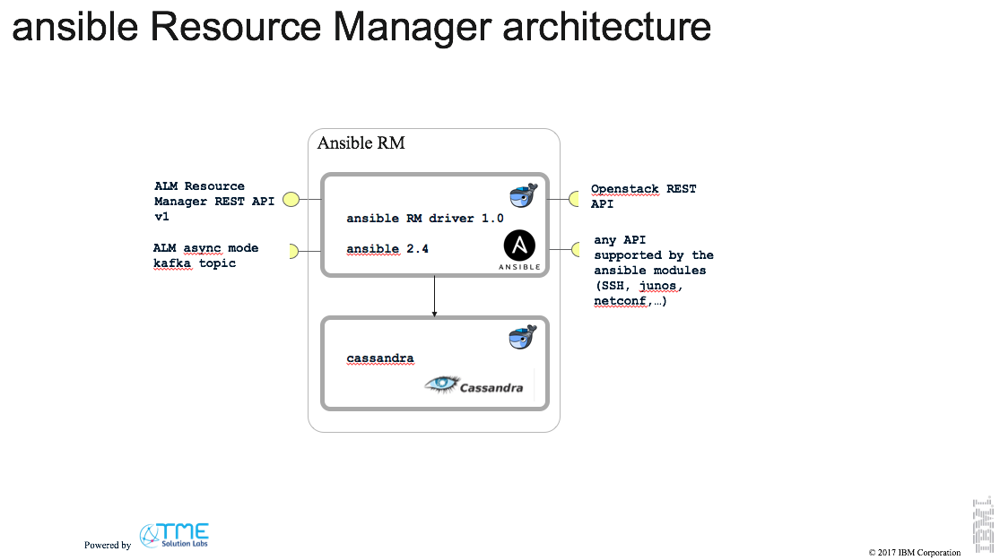

# ALM Resource Manager for Ansible
For a more detailed overview and context of this project reference the [opensource service lifecycle management project]( https://github.com/IBM/open-source-service-lifecycle-mgmt/blob/master/README.md)

This project provides a resource manager (RM) for the IBM Agile Lifecycle Manager (ALM) based on ansible (see https://www.ansible.com/ ).

It uses a plain out-of-the-box ansible, ie. not ansible-tower, so no REST APIs are available.
The ALM-RM API is built using swagger 2.0, and the python-flask server code generator.

It implements the ALM Resource Manager v1.1.2 API Specification and supports sync (REST) as well as async (kafka) mode of operations.
The resource packages are expected to be in a folder on the shared file system.
Requests, locations and instances are persisted in a cassandra db.
It is tested against ALM v1.2 and v2.0

The current architecture:


This resource manager is packaged in two docker containers managed by docker-compose.
- container running ansible 2, python3 and the swagger server
- container running cassandra 3

Folders for logging, keys and resources are shared with the host.
You should find them in `<install_dir>/var_alm_ansible_rm/driver/`

## Pre-reqs
- docker version >= 17.06.0-ce
- docker-compose version >= 1.14.0

The images have been tested on MacOS 10.12 and ubuntu xenial

## Installation
The steps to install this resource manager are described [here](docs/installation.md).

## hello-world
There is an [example hello-world resource](docs/hello-world.md) to test and explore a run-through
* from initiating a transition request
* running an ansible playbook
* returning id and properties from the playbook
* checking the request
* checking the resource instance


### Add Locations
- run the "create or update a deployment location" operation

Here is an example of location properties for an openstack tenant:  

```json
{
"auth_pwd": "mypass",
"auth_url": "http://osserver:35357/v2.0",
"auth_user": "admin",
"project": "admin"
}
```

This resource manager also supports the openstack python [openstack client config files](https://docs.openstack.org/os-client-config/latest/user/configuration.html) for details.
To use client config:
1. Name you config file: **clouds.yaml**
2. Put it in the **var_alm_ansible_rm/driver/clouds** folder
3. add a property "cloud: cloud_name" to your location. The cloud_name MUST be defined in your clouds.yaml file
4. Usage in your ansible os_... tasks
```yaml
os_server:
      cloud:  {{ cloud }}
      name: ...
```

All location properties are passed to your ansible playbooks.
So the location properties you need to specify depend on your ansible playbooks (e.g. how you connect to the openstack region). If your playbook connects to locations other than an openstack, just add all required properties to the location properties.


## Logs etc
The shared file system exposes these directories:
```
var_alm_ansible_rm/cassandra - all cassandra files
var_alm_ansible_rm/driver
   /logs  - the driver log files
   /resources - put your component packages here
   /keys - keypairs created by the playbooks
   /licenses - license files for VNFs
   /libraries - 3rd party ansible modules
   /clouds - the cloud.yaml file to capture openstack cloud credentials
```

# ansible Playbooks and Roles
There is a [set of requirements](docs/ansible-requirements.md) that need to be implemented in your ansible playbooks and roles so that this resource manager can successfully run these playbooks.
